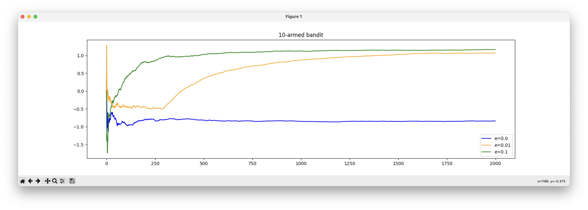

# bandit
## A 10-armed bandit problem example in Python

This demostration uses the Action-value Method with sample-averaging. 

The estimated reward of action $a$ at time step $t$ is defined as:
$$
Q_t(a) \equiv \frac{\text {sum of rewards when a taken prior to t}} {\text {number of times a taken prior to t }}
$$

### Exploration and Exploitation
The exploration-exploitation tradeoff, seen in the reinforcement learning theorem, balances seeking new options with maximizing known opportunities for long-term value.

Exploration involves taking risks, seeking new experiences, and challenging assumptions. It fuels personal growth and innovation, opening doors to hidden potential. Exploitation leverages existing knowledge, skills, and resources for maximum gains. Balancing the two requires continuous assessment and adjustment.

### Howto
1. pip install -r requirements.txt
2. python3 k-armed.py

### Result

